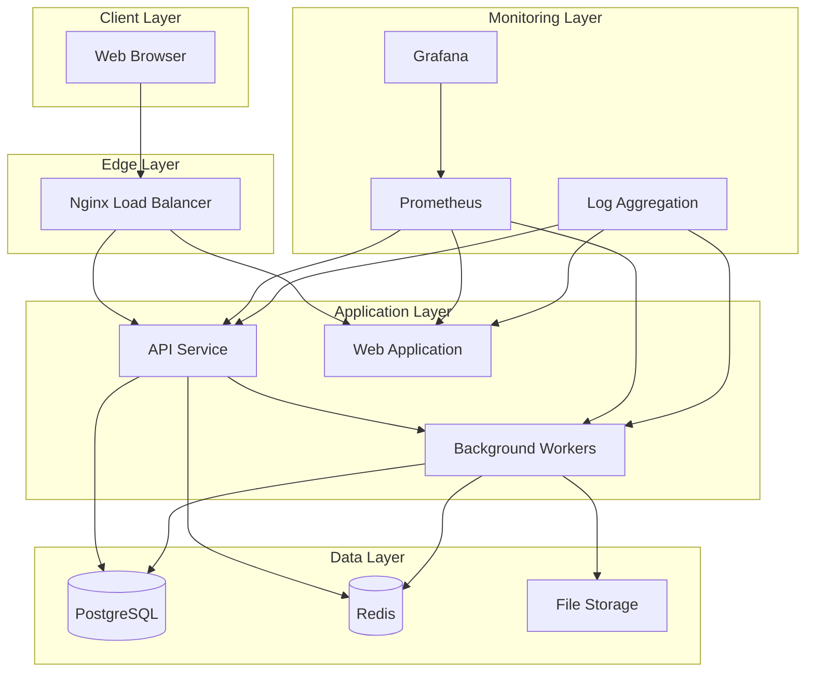
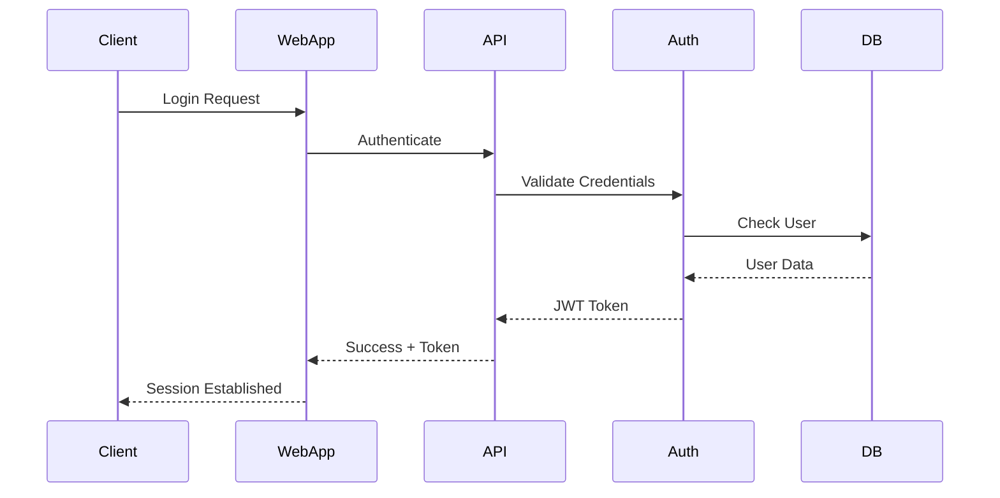
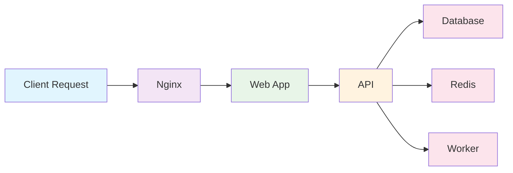
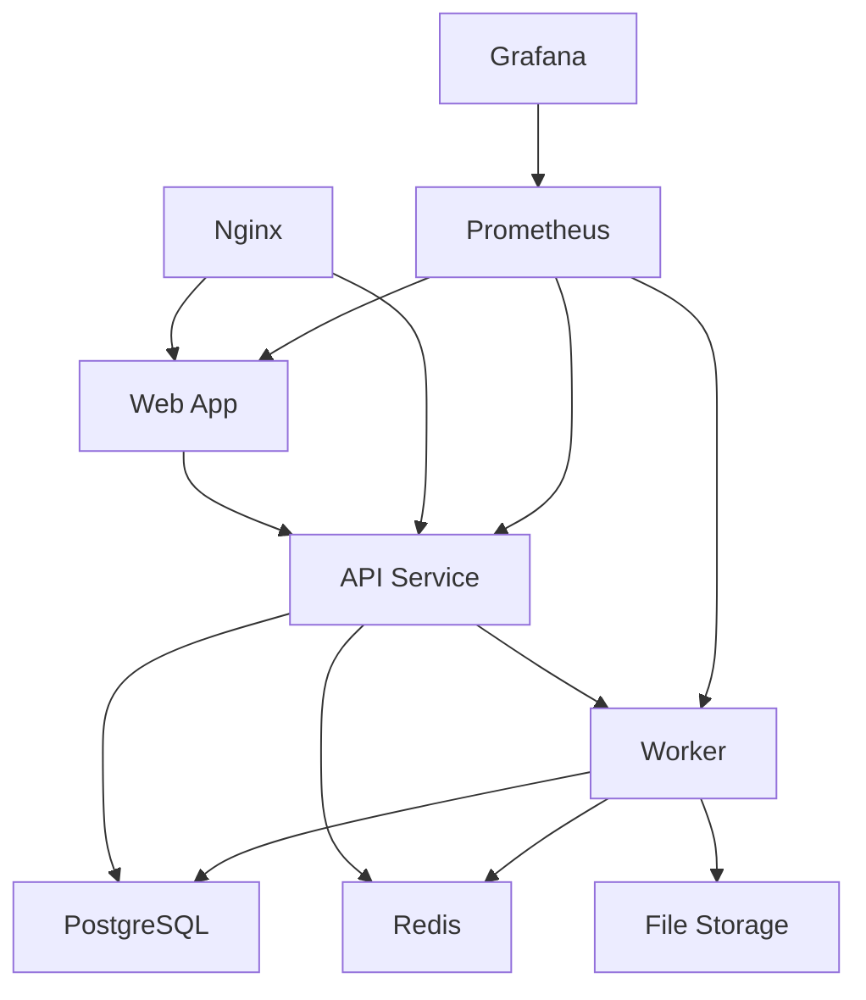
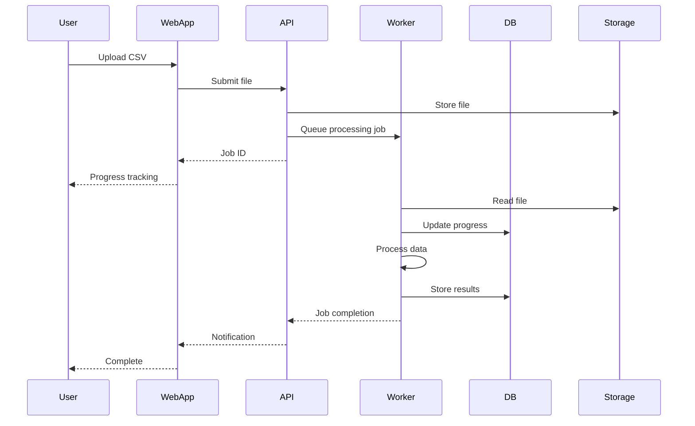

# Atlas2 Architecture Document

**Version:** 1.0.0  
**Last Updated:** October 19, 2025  
**Architect:** System Architecture Team  

## Executive Summary

Atlas2 is a cloud-native, microservices-based web application designed for high-performance CSV to API data mapping and transformation. The architecture follows industry best practices including containerization, event-driven processing, and scalable infrastructure patterns. This document outlines the complete system architecture, design decisions, and implementation guidelines.

## Table of Contents

1. [System Overview](#system-overview)
2. [Architecture Principles](#architecture-principles)
3. [High-Level Architecture](#high-level-architecture)
4. [Microservices Design](#microservices-design)
5. [Data Architecture](#data-architecture)
6. [Security Architecture](#security-architecture)
7. [Performance & Scalability](#performance--scalability)
8. [Infrastructure & Deployment](#infrastructure--deployment)
9. [Monitoring & Observability](#monitoring--observability)
10. [Development Architecture](#development-architecture)
11. [Technology Decisions](#technology-decisions)
12. [Future Considerations](#future-considerations)

---

## System Overview

### Purpose
Atlas2 enables users to upload CSV files, visually map fields to API endpoints, and transform data for seamless integration with external systems. The system processes large files efficiently through streaming architecture and provides real-time feedback.

### Key Requirements
- **Performance**: Process 3GB+ CSV files with ≤500MB RAM usage
- **Scalability**: Handle concurrent users and file processing
- **Reliability**: 99.9% uptime with graceful error handling
- **Security**: Enterprise-grade authentication and data protection
- **Usability**: Intuitive web interface with real-time progress tracking

### Scope
- Web-based CSV upload and processing
- Visual field mapping interface
- Dynamic API client generation
- Multi-method authentication support
- Real-time monitoring and analytics
- Container-based deployment

---

## Architecture Principles

### 1. Microservices First
- **Single Responsibility**: Each service has a well-defined purpose
- **Loose Coupling**: Services communicate via well-defined APIs
- **High Cohesion**: Related functionality grouped within services
- **Independent Deployment**: Services can be deployed and scaled independently

### 2. Cloud-Native Design
- **Containerization**: All services run in Docker containers
- **Orchestration**: Docker Compose for deployment, Kubernetes-ready
- **Stateless Services**: Application state managed externally
- **Configuration Management**: Environment-based configuration

### 3. Event-Driven Architecture
- **Asynchronous Processing**: Heavy tasks handled by background workers
- **Message Queues**: Redis for job queuing and pub/sub
- **Event Sourcing**: Important state changes logged as events
- **CQRS**: Separate read and write models where appropriate

### 4. Security by Design
- **Zero Trust**: All communications authenticated and authorized
- **Defense in Depth**: Multiple security layers
- **Principle of Least Privilege**: Minimal access permissions
- **Data Encryption**: Encryption at rest and in transit

### 5. Observability First
- **Structured Logging**: Consistent, searchable log format
- **Metrics Collection**: Comprehensive performance metrics
- **Distributed Tracing**: Request flow across services
- **Health Monitoring**: Proactive health checks and alerts

---

## High-Level Architecture



### Layer Responsibilities

#### Client Layer
- **Web Browser**: Modern browser with JavaScript support
- **Progressive Enhancement**: Works with varying network conditions
- **Responsive Design**: Adapts to different screen sizes

#### Edge Layer
- **Nginx**: Reverse proxy, load balancing, SSL termination
- **Rate Limiting**: Request throttling and DDoS protection
- **Static Asset Serving**: Optimized delivery of frontend assets
- **Caching**: HTTP caching for improved performance

#### Application Layer
- **Web Application**: React-based frontend SPA
- **API Service**: RESTful API for business logic
- **Background Workers**: Asynchronous job processing

#### Data Layer
- **PostgreSQL**: Primary relational database
- **Redis**: Caching, sessions, and job queues
- **File Storage**: Local or cloud-based file storage

#### Monitoring Layer
- **Prometheus**: Metrics collection and alerting
- **Grafana**: Visualization and dashboards
- **Log Aggregation**: Centralized log management

---

## Microservices Design

### 1. Web Application Service

**Purpose**: Frontend SPA serving the user interface

**Technology Stack**:
- React 18 with TypeScript
- Ant Design UI components
- Zustand for state management
- Vite for build optimization

**Key Features**:
- File upload interface with drag-and-drop
- Visual field mapping with drag-and-drop
- Real-time progress tracking
- API client generation interface
- Authentication and user management

**API Endpoints**:
- Serves static files via Nginx
- Communicates with API service via REST
- WebSocket connections for real-time updates

**Scaling Considerations**:
- Stateless design enables horizontal scaling
- CDN integration for static assets
- Service worker for offline capabilities

### 2. API Service

**Purpose**: Core business logic and data management

**Technology Stack**:
- Node.js with Express
- TypeScript for type safety
- Helmet for security headers
- CORS for cross-origin requests

**Key Responsibilities**:
- Request validation and authentication
- Business logic orchestration
- Database operations
- File upload coordination
- Job queue management

**API Design**:
```yaml
# RESTful API Structure
/api/v1/
├── auth/              # Authentication endpoints
├── upload/            # File upload management
├── mappings/          # Field mapping operations
├── transformations/   # Data transformation jobs
├── apis/             # External API configurations
└── monitoring/       # Health and metrics
```

**Performance Optimizations**:
- Request/response compression
- Database connection pooling
- Redis caching for frequent queries
- Rate limiting and throttling

### 3. Background Worker Service

**Purpose**: Asynchronous processing of heavy tasks

**Technology Stack**:
- Node.js with TypeScript
- Bull queue for job management
- Papa Parse for CSV processing
- Custom streaming processors

**Job Types**:
- **CSV Processing**: Stream-based file parsing and validation
- **Data Transformation**: Field mapping and data conversion
- **API Integration**: External API communication
- **Report Generation**: Analytics and reporting tasks

**Processing Pipeline**:


**Error Handling**:
- Automatic retry with exponential backoff
- Dead letter queue for failed jobs
- Comprehensive error logging
- User notification system

---

## Data Architecture

### 1. Database Design (PostgreSQL)

**Schema Organization**:
```sql
-- Core business entities
users                    -- User management
file_uploads            -- File metadata
processing_jobs         -- Job tracking
api_configurations      -- External API settings
field_mappings          -- Mapping definitions
transformation_history  -- Execution history

-- Supporting entities
user_sessions           -- Authentication sessions
system_logs            -- Audit logs
notifications          -- User notifications
system_metrics         -- Performance data
```

**Design Patterns**:
- **UUID Primary Keys**: Distributed-friendly identifiers
- **Soft Deletes**: Preserve data integrity
- **Audit Columns**: Created/updated timestamps
- **JSONB Fields**: Flexible schema evolution
- **Partitioning**: Large tables by date

**Performance Optimizations**:
```sql
-- Strategic indexes
CREATE INDEX CONCURRENTLY idx_processing_jobs_status_created 
ON processing_jobs(job_status, created_at);

CREATE INDEX CONCURRENTLY idx_file_uploads_user_status 
ON file_uploads(user_id, upload_status);

-- Partial indexes for common queries
CREATE INDEX CONCURRENTLY idx_active_jobs 
ON processing_jobs(created_at) 
WHERE job_status IN ('pending', 'processing');
```

### 2. Cache Design (Redis)

**Data Types and Usage**:
```yaml
# Session Management
sessions:{user_id}           # User session data
  Type: Hash
  TTL: 24 hours

# Job Queue
jobs:pending                 # Pending jobs queue
  Type: List
jobs:processing:{worker_id}  # Worker-specific queues
  Type: List

# Caching
api_configs:{user_id}        # User API configurations
  Type: Hash
  TTL: 1 hour

field_mappings:{job_id}      # Job-specific mappings
  Type: Hash
  TTL: 6 hours

# Rate Limiting
rate_limit:{user_id}:{endpoint} # API rate limiting
  Type: String
  TTL: 1 minute

# Real-time Data
job_progress:{job_id}        # Real-time job progress
  Type: Hash
  TTL: 24 hours
```

### 3. File Storage Architecture

**Storage Strategy**:
```yaml
# File Organization
uploads/
├── {year}/
│   ├── {month}/
│   │   ├── {day}/
│   │   │   ├── {user_id}/
│   │   │   │   ├── original/
│   │   │   │   ├── processed/
│   │   │   │   └── temp/
```

**File Lifecycle**:
1. **Upload**: Temporary storage during upload
2. **Processing**: Moved to processing directory
3. **Validation**: Stored with validation metadata
4. **Archive**: Moved to long-term storage
5. **Cleanup**: Automatic cleanup based on policy

---

## Security Architecture

### 1. Authentication & Authorization

**Authentication Flow**:


**Security Measures**:
- **JWT Tokens**: Stateless authentication with refresh tokens
- **Password Hashing**: bcrypt with salt rounds
- **Session Management**: Redis-based session storage
- **Multi-Factor Auth**: Optional 2FA support
- **OAuth Integration**: Third-party authentication

### 2. Data Protection

**Encryption Strategy**:
```yaml
# In Transit
TLS 1.3: All external communications
Internal TLS: Service-to-service encryption

# At Rest
Database Encryption: PostgreSQL TDE
File Encryption: AES-256 for sensitive files
Environment Variables: Encrypted secrets

# In Memory
Sensitive Data: Automatic memory clearing
Key Management: Secure key rotation
```

**Data Classification**:
- **Public**: Non-sensitive application data
- **Internal**: User data and business logic
- **Confidential**: API keys and credentials
- **Restricted**: System secrets and encryption keys

### 3. Network Security

**Network Segmentation**:
```yaml
# DMZ Layer
Nginx Load Balancer
SSL Termination
Rate Limiting

# Application Layer
Web Application
API Service
Internal Load Balancer

# Data Layer
PostgreSQL
Redis
File Storage

# Management Layer
Monitoring
Logging
Backup Systems
```

**Firewall Rules**:
- **Inbound**: Only necessary ports exposed
- **Outbound**: Restricted to required services
- **Internal**: Service-to-service communication only
- **Management**: Separate management network

---

## Performance & Scalability

### 1. Performance Optimization

**Frontend Optimization**:
```yaml
# Bundle Optimization
Code Splitting: Route-based chunks
Tree Shaking: Dead code elimination
Minification: Production builds
Compression: Gzip/Brotli

# Loading Optimization
Lazy Loading: Component and route lazy loading
Prefetching: Intelligent resource prefetching
CDN: Static asset distribution
Service Worker: Offline caching

# Runtime Optimization
Virtual Scrolling: Large data sets
Memoization: Expensive computations
Debouncing: User input optimization
Web Workers: Background processing
```

**Backend Optimization**:
```yaml
# Database Optimization
Connection Pooling: PgBouncer integration
Query Optimization: Index usage analysis
Read Replicas: Read scaling
Caching Strategy: Multi-level caching

# API Optimization
Response Compression: Gzip middleware
Pagination: Large dataset handling
Batch Operations: Bulk processing
Async Processing: Non-blocking I/O

# Memory Management
Streaming: Large file processing
Garbage Collection: Memory leak prevention
Resource Limits: Container constraints
Monitoring: Memory usage tracking
```

### 2. Scalability Strategy

**Horizontal Scaling**:
```yaml
# Stateless Services
Web Application: Multiple instances
API Service: Load-balanced instances
Workers: Queue-based scaling

# Database Scaling
Read Replicas: Read traffic distribution
Connection Pooling: Efficient resource use
Sharding: Future horizontal partitioning

# Cache Scaling
Redis Cluster: Distributed caching
Consistent Hashing: Key distribution
Failover: High availability
```

**Auto-scaling Configuration**:
```yaml
# Scaling Triggers
CPU Utilization: >70% for 5 minutes
Memory Usage: >80% for 3 minutes
Queue Length: >100 pending jobs
Response Time: >2 seconds average

# Scaling Policies
Min Instances: 2 per service
Max Instances: 10 per service
Scale Up Cooldown: 5 minutes
Scale Down Cooldown: 10 minutes
```

---

## Infrastructure & Deployment

### 1. Container Architecture

**Container Design Principles**:
- **Single Process**: One main process per container
- **Immutable Infrastructure**: Containers never modified in place
- **Resource Limits**: CPU and memory constraints
- **Health Checks**: Comprehensive health monitoring

**Container Optimization**:
```dockerfile
# Multi-stage builds
FROM node:18-alpine AS builder
# Build dependencies and application

FROM node:18-alpine AS runtime
# Production runtime with minimal footprint

# Security hardening
RUN addgroup -g 1001 -S nodejs
RUN adduser -S nodejs -u 1001
USER nodejs
```

### 2. Orchestration Strategy

**Docker Compose Configuration**:
```yaml
# Service Dependencies
depends_on:
  - postgres
  - redis

# Health Checks
healthcheck:
  test: ["CMD", "curl", "-f", "http://localhost:3001/health"]
  interval: 30s
  timeout: 10s
  retries: 3

# Resource Limits
deploy:
  resources:
    limits:
      cpus: '0.5'
      memory: 512M
    reservations:
      cpus: '0.25'
      memory: 256M
```

**Kubernetes Readiness**:
- **Deployments**: Rolling updates and rollbacks
- **Services**: Load balancing and service discovery
- **ConfigMaps**: Configuration management
- **Secrets**: Secure credential management
- **Ingress**: External access routing

### 3. CI/CD Pipeline

**Pipeline Stages**:
```yaml
# Build Stage
1. Code Checkout
2. Dependency Installation
3. Unit Testing
4. Code Quality Checks
5. Security Scanning
6. Container Building
7. Image Scanning

# Deploy Stage
1. Environment Provisioning
2. Database Migrations
3. Service Deployment
4. Health Checks
5. Integration Testing
6. Traffic Switching
7. Monitoring Setup
```

**Deployment Strategies**:
- **Blue-Green**: Zero-downtime deployments
- **Canary**: Gradual traffic shifting
- **Rolling**: Incremental updates
- **Rollback**: Automatic failure recovery

---

## Monitoring & Observability

### 1. Metrics Collection

**Application Metrics**:
```yaml
# Business Metrics
Files Processed: Count and size
Processing Time: Duration percentiles
Error Rates: Failure percentages
User Activity: Active users and sessions

# Technical Metrics
Response Time: API latency percentiles
Throughput: Requests per second
Resource Usage: CPU, memory, disk
Error Rates: HTTP status codes

# Infrastructure Metrics
Container Health: Status and restarts
Database Performance: Query times and connections
Cache Hit Rates: Redis efficiency
Queue Lengths: Job queue sizes
```

**Prometheus Configuration**:
```yaml
# Scrape Configuration
scrape_configs:
  - job_name: 'atlas2-api'
    static_configs:
      - targets: ['api:3001']
    metrics_path: '/metrics'
    scrape_interval: 30s

# Alerting Rules
groups:
  - name: atlas2.rules
    rules:
      - alert: HighErrorRate
        expr: rate(http_requests_total{status=~"5.."}[5m]) > 0.1
        for: 5m
```

### 2. Logging Strategy

**Structured Logging**:
```typescript
// Log Format
{
  "timestamp": "2025-10-19T10:30:00Z",
  "level": "info",
  "service": "api",
  "trace_id": "abc123",
  "user_id": "user456",
  "message": "File uploaded successfully",
  "context": {
    "file_id": "file789",
    "file_size": 1024000,
    "processing_time": 1500
  }
}
```

**Log Levels and Retention**:
```yaml
# Log Levels
ERROR: Immediate attention required
WARN: Potential issues
INFO: Important events
DEBUG: Detailed debugging

# Retention Policy
ERROR: 90 days
WARN: 30 days
INFO: 14 days
DEBUG: 7 days
```

### 3. Distributed Tracing

**Request Flow Tracking**:


**Trace Context Propagation**:
- **Trace ID**: Unique request identifier
- **Span ID**: Individual operation identifier
- **Parent Span**: Operation hierarchy
- **Baggage Items**: Context metadata

---

## Development Architecture

### 1. Code Organization

**Monorepo Structure**:
```
atlas2/
├── packages/
│   ├── web/                 # Frontend application
│   ├── api/                 # Backend API
│   ├── worker/              # Background processing
│   ├── shared/              # Shared utilities
│   └── types/               # TypeScript definitions
├── infrastructure/          # Docker and deployment
├── monitoring/             # Observability configs
├── docs/                   # Documentation
└── scripts/                # Build and utility scripts
```

**Module Design**:
- **High Cohesion**: Related functionality grouped
- **Low Coupling**: Minimal dependencies between modules
- **Clear Interfaces**: Well-defined module boundaries
- **Testability**: Easy unit and integration testing

### 2. Development Workflow

**Git Workflow**:
```yaml
# Branch Strategy
main: Production-ready code
develop: Integration branch
feature/*: Feature development
hotfix/*: Production fixes
release/*: Release preparation

# Pull Request Process
1. Feature branch creation
2. Development and testing
3. Pull request creation
4. Code review
5. Automated checks
6. Merge to develop
7. Release to main
```

**Quality Gates**:
```yaml
# Automated Checks
Unit Tests: >90% coverage
Integration Tests: Critical paths
Linting: Code style enforcement
Security Scanning: Vulnerability detection
Performance Tests: Regression prevention
```

### 3. Testing Strategy

**Testing Pyramid**:
```yaml
# Unit Tests (70%)
- Individual component testing
- Fast execution
- Mocked dependencies
- High coverage

# Integration Tests (20%)
- Service interaction testing
- Database integration
- API endpoint testing
- Real dependencies

# End-to-End Tests (10%)
- User workflow testing
- Browser automation
- Real environment
- Critical paths only
```

---

## Technology Decisions

### 1. Frontend Technology Stack

**React 18 + TypeScript**:
- **Component Architecture**: Reusable UI components
- **Type Safety**: Compile-time error detection
- **Ecosystem**: Rich library ecosystem
- **Performance**: Concurrent features and optimizations

**Ant Design**:
- **Enterprise UI**: Professional component library
- **Accessibility**: WCAG compliance
- **Customization**: Theme system
- **Internationalization**: Multi-language support

**Vite**:
- **Development Speed**: Fast hot reload
- **Build Performance**: Optimized bundling
- **Modern Features**: ES modules and native ESM
- **Plugin Ecosystem**: Extensible architecture

### 2. Backend Technology Stack

**Node.js + Express**:
- **JavaScript Ecosystem**: Full-stack JavaScript
- **Performance**: Event-driven, non-blocking I/O
- **Scalability**: Microservices friendly
- **Community**: Large ecosystem and support

**PostgreSQL**:
- **Reliability**: ACID compliance and stability
- **Features**: Advanced SQL features and extensions
- **Performance**: Query optimization and indexing
- **Scalability**: Replication and partitioning

**Redis**:
- **Performance**: In-memory speed
- **Versatility**: Multiple data structures
- **Persistence**: Optional data durability
- **Clustering**: High availability and scaling

### 3. Infrastructure Technology

**Docker**:
- **Consistency**: Environment parity
- **Portability**: Cross-platform deployment
- **Isolation**: Process and resource isolation
- **Ecosystem**: Rich tooling and integration

**Nginx**:
- **Performance**: High concurrency handling
- **Features**: Load balancing and caching
- **Reliability**: Battle-tested stability
- **Flexibility**: Extensive configuration options

### 4. Rationale for Key Decisions

**Microservices over Monolith**:
- **Scalability**: Independent service scaling
- **Technology Diversity**: Best tool for each job
- **Team Autonomy**: Independent development cycles
- **Fault Isolation**: Service failure containment

**PostgreSQL over NoSQL**:
- **Data Integrity**: ACID transactions
- **Query Power**: Complex query capabilities
- **Maturity**: Proven reliability
- **Ecosystem**: Tooling and expertise

**Redis over In-Memory**:
- **Persistence**: Data durability options
- **Features**: Advanced data structures
- **Clustering**: Built-in high availability
- **Monitoring**: Operational visibility

---

## Future Considerations

### 1. Scalability Enhancements

**Database Scaling**:
```yaml
# Short Term (6-12 months)
Read Replicas: Read traffic distribution
Connection Pooling: Resource optimization
Query Optimization: Performance tuning

# Medium Term (12-18 months)
Database Sharding: Horizontal partitioning
CQRS Pattern: Read/write separation
Event Sourcing: Audit trail and replay

# Long Term (18+ months)
Multi-Region Deployment: Geographic distribution
Polyglot Persistence: Specialized databases
Graph Database: Relationship optimization
```

**Application Scaling**:
```yaml
# Service Mesh
Istio/Linkerd: Service communication
Observability: Distributed tracing
Security: mTLS and policies
Traffic Management: Advanced routing

# Serverless
Functions: Event-driven processing
API Gateway: Managed API endpoints
Event Bus: Event-driven architecture
```

### 2. Technology Evolution

**Frontend Modernization**:
- **Micro-Frontends**: Independent frontend modules
- **WebAssembly**: Performance-critical computations
- **Progressive Web App**: Enhanced mobile experience
- **Edge Computing**: CDN-based computation

**Backend Evolution**:
- **GraphQL**: Flexible API queries
- **gRPC**: High-performance service communication
- **Event-Driven Architecture**: Async processing
- **Machine Learning**: Intelligent data processing

### 3. Security Enhancements

**Advanced Security**:
```yaml
# Zero Trust Architecture
Service Mesh Security: mTLS for all services
Identity Federation: SSO integration
Privileged Access Management: Just-in-time access
Security Analytics: Threat detection

# Data Protection
Homomorphic Encryption: Computation on encrypted data
Differential Privacy: Privacy-preserving analytics
Blockchain Integration: Immutable audit trails
Quantum-Resistant Cryptography: Future-proofing
```

### 4. Operational Excellence

**Automation**:
```yaml
# Infrastructure as Code
Terraform: Multi-cloud provisioning
Ansible: Configuration management
GitOps: Automated deployment
Policy as Code: Compliance automation

# AIOps
Predictive Scaling: ML-based resource management
Anomaly Detection: Automated issue identification
Self-Healing: Automatic problem resolution
Capacity Planning: Predictive resource planning
```

---

## Conclusion

The Atlas2 architecture is designed to be scalable, maintainable, and secure while providing excellent performance for CSV processing and API integration. The microservices approach allows for independent scaling and development, while the container-based deployment ensures consistency across environments.

Key architectural strengths:
- **Scalability**: Horizontal scaling at all layers
- **Reliability**: Fault isolation and graceful degradation
- **Security**: Defense-in-depth security model
- **Performance**: Optimized for large file processing
- **Maintainability**: Clear separation of concerns
- **Observability**: Comprehensive monitoring and logging

The architecture is future-proof and ready for evolution as requirements grow and technology advances. Regular architecture reviews and incremental improvements will ensure the system continues to meet business needs effectively.

---

## Appendices

### A. Service Dependencies


### B. Data Flow Diagram


### C. Technology Matrix
| Component | Technology | Version | Rationale |
|-----------|------------|---------|-----------|
| Frontend | React | 18.2+ | Component architecture, ecosystem |
| Backend | Node.js | 18+ | JavaScript ecosystem, performance |
| Database | PostgreSQL | 15+ | Reliability, features, performance |
| Cache | Redis | 7+ | Speed, versatility, clustering |
| Container | Docker | 20+ | Industry standard, ecosystem |
| Web Server | Nginx | 1.24+ | Performance, reliability, features |
| Monitoring | Prometheus | 2.40+ | Metrics, alerting, ecosystem |
| Visualization | Grafana | 9.0+ | Dashboards, visualization |

### D. Configuration Templates
[Additional configuration templates and examples would be included in a full document]

---

*This architecture document is a living document and should be updated as the system evolves. Regular reviews should be conducted to ensure the architecture continues to meet business and technical requirements.*