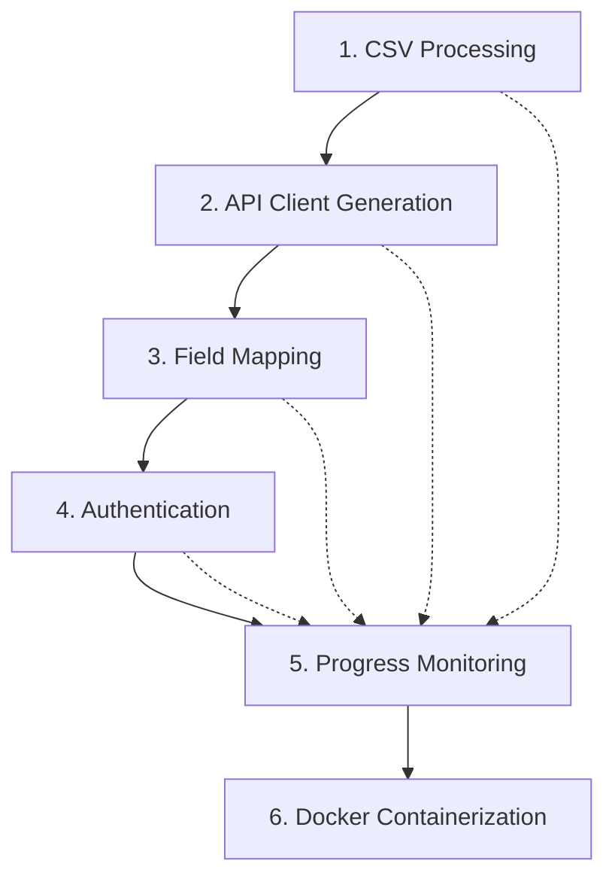

# Atlas2 MVP - Epic Summary

**Project:** Atlas2 CSV to API Mapping Tool  
**Version:** MVP  
**Created:** October 19, 2025  
**Total Epics:** 6  

## Executive Summary

This document provides a comprehensive overview of the six brownfield epics that comprise the Atlas2 MVP. Each epic is designed to deliver specific functionality while maintaining system integrity and following established patterns. The epics are sequenced to enable incremental delivery and testing, with clear dependencies and integration points.

## Epic Overview

### 1. CSV File Upload & Processing
**Focus:** Core data ingestion capabilities  
**Business Value:** Enables the fundamental data input pipeline  
**Key Features:** Streaming processing, large file support, real-time validation  
**Timeline:** 4-6 weeks  

### 2. Basic API Client Generation  
**Focus:** Dynamic API integration capabilities  
**Business Value:** Eliminates manual API integration work  
**Key Features:** OpenAPI support, automatic client generation, endpoint discovery  
**Timeline:** 3-4 weeks  

### 3. Visual Field Mapping Interface  
**Focus:** User-friendly data transformation  
**Business Value:** Enables non-technical users to handle complex mappings  
**Key Features:** Drag-and-drop interface, field transformations, real-time validation  
**Timeline:** 4-5 weeks  

### 4. Simple Authentication  
**Focus:** Secure API access capabilities  
**Business Value:** Enables enterprise-grade security and integration  
**Key Features:** Multiple auth methods, secure credential storage, token management  
**Timeline:** 3-4 weeks  

### 5. Progress Monitoring & Error Reporting  
**Focus:** Operational visibility and troubleshooting  
**Business Value:** Reduces support overhead and improves user experience  
**Key Features:** Real-time monitoring, error classification, recovery tools  
**Timeline:** 3-4 weeks  

### 6. Docker Containerization  
**Focus:** Deployment infrastructure and operations  
**Business Value:** Enables simplified deployment and scaling  
**Key Features:** Multi-container setup, production configuration, deployment automation  
**Timeline:** 2-3 weeks  

## Epic Dependencies

### Critical Path Analysis

**Primary Dependencies:**
- Epic 1 (CSV Processing) → Epic 2 (API Client Generation)
- Epic 2 → Epic 3 (Field Mapping)
- Epic 3 → Epic 4 (Authentication)
- Epic 4 → Epic 5 (Progress Monitoring)

**Supporting Dependencies:**
- All previous epics support Epic 5 (Progress Monitoring)
- All epics are containerized in Epic 6

## Implementation Strategy

### Phase 1: Foundation (Weeks 1-6)
**Epics:** 1 (CSV Processing) + 2 (API Client Generation)  
**Deliverable:** Basic data processing and API integration capabilities  
**MVP Criteria:** Users can upload CSV files and connect to basic APIs

### Phase 2: User Experience (Weeks 7-11)
**Epics:** 3 (Field Mapping) + 4 (Authentication)  
**Deliverable:** Complete user workflow with security  
**MVP Criteria:** Users can map fields and authenticate with APIs

### Phase 3: Operations (Weeks 12-15)
**Epics:** 5 (Progress Monitoring) + 6 (Docker Containerization)  
**Deliverable:** Production-ready deployment and monitoring  
**MVP Criteria:** System is deployable and observable in production

## Risk Assessment

### High-Risk Epics
1. **Epic 1 (CSV Processing):** Memory management with large files
2. **Epic 3 (Field Mapping):** UI performance with large datasets
3. **Epic 6 (Docker Containerization):** Production deployment complexity

### Medium-Risk Epics
1. **Epic 2 (API Client Generation):** OpenAPI specification compatibility
2. **Epic 4 (Authentication):** Security implementation
3. **Epic 5 (Progress Monitoring):** Real-time communication performance

## Resource Requirements

### Development Team
- **Full Stack Developer:** Lead implementation across all epics
- **Frontend Specialist:** Focus on Epics 3 and 5
- **Backend Specialist:** Focus on Epics 1, 2, and 4
- **DevOps Engineer:** Focus on Epic 6

### Technical Resources
- **Development Environment:** Docker, Node.js, React
- **Testing Infrastructure:** Automated testing across all components
- **CI/CD Pipeline:** Automated build and deployment
- **Monitoring Stack:** Application and infrastructure monitoring

## Success Metrics

### Technical Metrics
- **Code Coverage:** >90% across all epics
- **Performance:** Meet all specified performance requirements
- **Security:** Zero critical vulnerabilities
- **Reliability:** >99.5% uptime in production

### Business Metrics
- **User Adoption:** >80% feature utilization rate
- **Task Completion:** >95% success rate for core workflows
- **User Satisfaction:** >4.5/5 satisfaction score
- **Support Reduction:** >50% reduction in support tickets

## Quality Gates

### Epic Completion Criteria
- All stories completed with acceptance criteria met
- Integration testing with dependent epics
- Performance benchmarks met
- Security requirements satisfied
- Documentation complete and accurate

### MVP Release Criteria
- All six epics completed and integrated
- End-to-end testing across complete user workflow
- Production deployment verified
- Performance and security testing passed
- User acceptance testing completed

## Next Steps

### Immediate Actions
1. **Epic 1 Kickoff:** Begin CSV processing implementation
2. **Environment Setup:** Establish development and testing infrastructure
3. **Team Assignment:** Allocate resources based on epic priorities
4. **Risk Mitigation:** Implement monitoring for high-risk areas

### Parallel Activities
1. **UI/UX Design:** Finalize interface designs for Epics 3 and 5
2. **Security Planning:** Complete security architecture for Epic 4
3. **Infrastructure Planning:** Design container architecture for Epic 6
4. **Testing Strategy:** Develop comprehensive testing approach

## Conclusion

The six epics provide a comprehensive roadmap for delivering the Atlas2 MVP with clear business value, technical feasibility, and manageable risk. The phased approach enables incremental delivery while maintaining focus on the complete user experience. Each epic is designed to be independently valuable while contributing to the overall product vision.

The brownfield approach ensures that we build upon existing patterns and maintain system integrity while delivering new capabilities. The dependency structure enables parallel development where possible while ensuring proper sequencing for critical path items.

Success will be measured by both technical excellence and business impact, with a focus on user adoption, operational efficiency, and competitive differentiation in the CSV to API integration market.